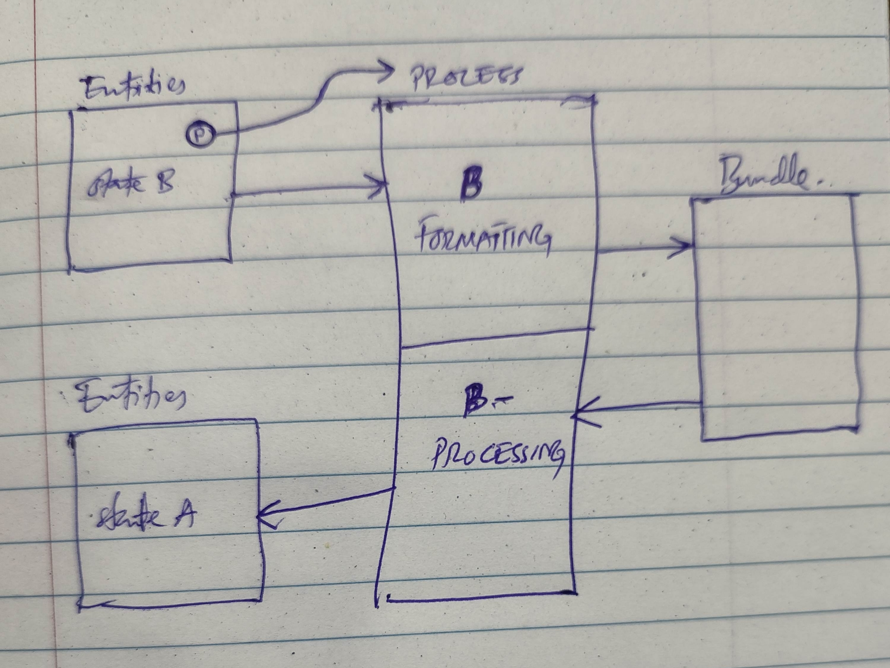

Oh! Not again. I often find myself forgetting what I wanted to say, and life has a way of making that even more regrettable. But this wasn't like a message to humanity; it was more about getting something off my chest. 

Most of the time, though, I forget to document great ideas. ==Wanavakan.idea== is simply my way of capturing and sharing these thoughts. I hope you'll learn and enjoy reading them.

>[!abstract] Shots Of Courage
>
>*Sep 17, 2024*
>Under the sun, she's hungry and thirsty. She has no legs to take her places, and no Family for the hands to hold onto. The little attention she gets all day from pedestrians isn't because of her beauty. What is even left of her state if food is the only priority she can afford?
>[[articles/published/Shots Of Courage.md|Read More]]

Thank you for visiting! For a full list of articles, please [click here](/articles)

*Last updated: 2025-09-18*

